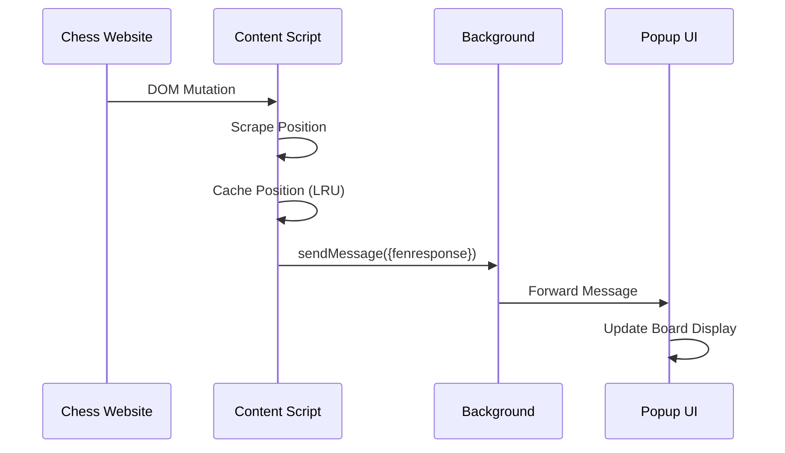
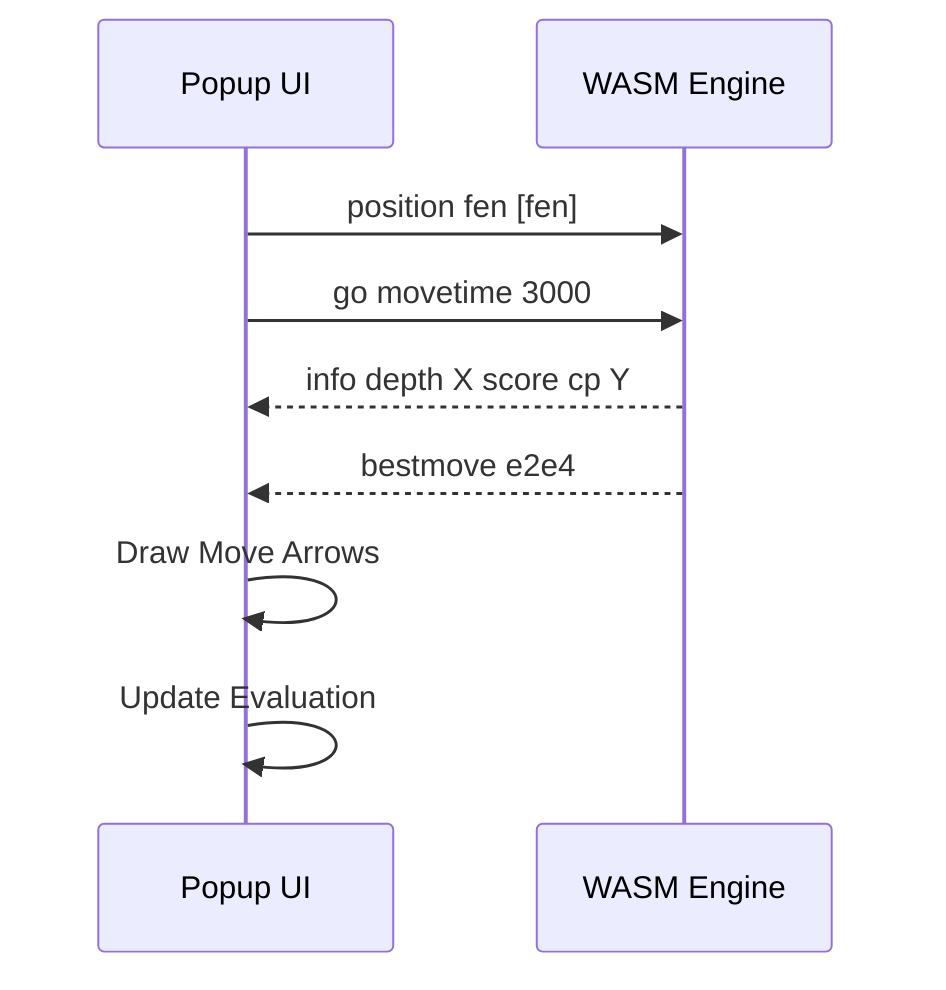
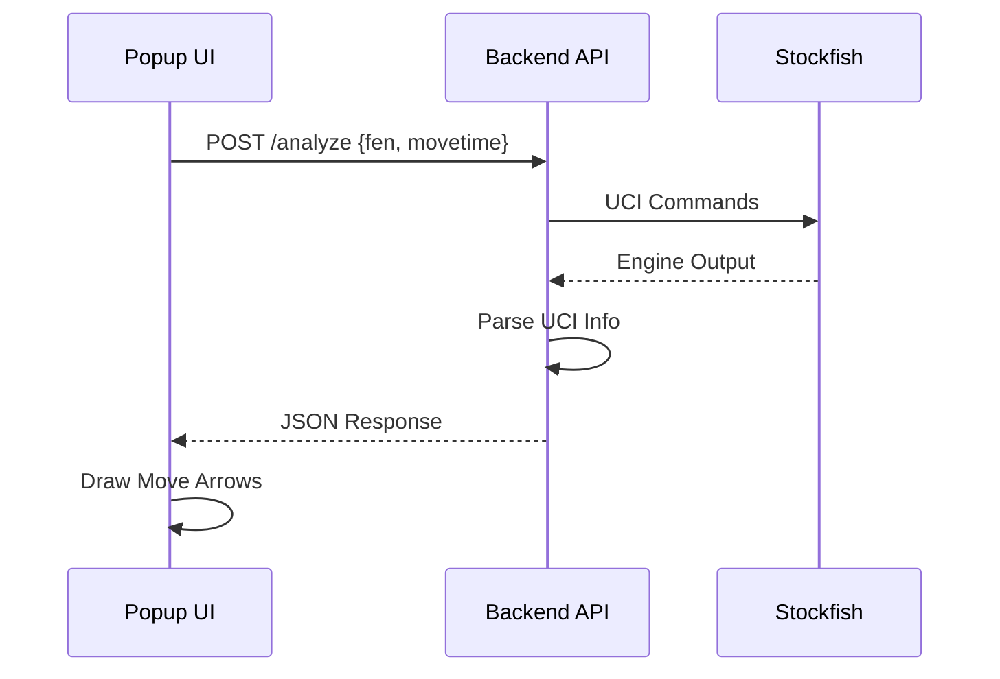

# ChessSight Architecture

## System Overview

ChessSight is a browser extension that provides real-time chess analysis for online chess platforms. The system consists of three main components: content scripts, extension UI, and optional backend API.

```mermaid
graph TB
    subgraph "Chess Website"
        Board[Chess Board DOM]
    end
    
    subgraph "Browser Extension"
        CS[Content Script]
        BG[Background Script]  
        Popup[Popup/Sidebar UI]
        Engine[Chess Engine]
    end
    
    subgraph "Backend (Optional)"
        API[FastAPI Server]
        SF[Stockfish Process]
    end
    
    Board --|Scrapes Position| CS
    CS --|Message Passing| BG
    BG --|Forwards Messages| Popup
    Popup --|UCI Commands| Engine
    Engine --|Best Moves| Popup
    Popup --|HTTP Request| API
    API --|Engine Analysis| SF
    SF --|Evaluation| API
    API --|JSON Response| Popup
    
    style Board fill:#e1f5ff
    style Engine fill:#fff4e1
    style SF fill:#fff4e1
```

## Component Details

### 1. Content Script (`src/scripts/content-script.js`)

**Purpose**: Injected into chess website pages to detect and extract board positions.

**Responsibilities**:
- Detects which chess site (Chess.com, Lichess, BlitzTactics)
- Scrapes current board position from DOM
- Monitors board changes via MutationObserver
- Supports two modes:
  - **FEN mode**: Scrapes move history from move list
  - **Puzzle mode**: Scrapes piece positions directly from DOM
- Caches positions using LRU cache for performance
- Handles Chess960 and variant starting positions
- Can simulate moves for autoplay feature

**Key Functions**:
- `scrapePosition()` - Determines scraping mode and extracts position
- `scrapePositionFen()` - Scrapes from move history
- `scrapePositionPuz()` - Scrapes from piece DOM elements
- `getOrientation()` - Determines board orientation (white/black)
- `simulateMove()` - Automates moves via click simulation

**Communication**: Sends position updates to popup via `chrome.runtime.sendMessage()`

---

### 2. Background Script (`src/scripts/background-script.js`)

**Purpose**: Service worker that routes messages between components.

**Responsibilities**:
- Opens/manages side panel (Chrome) or popup (Safari)
- Routes messages between content script and popup
- Lightweight message broker

**Platform Differences**:
- Chrome: Uses Side Panel API
- Safari: Uses standard popup

---

### 3. Popup/Sidebar UI (`src/popup/popup.js`, `popup.html`)

**Purpose**: Main user interface for displaying analysis.

**Responsibilities**:
- Displays interactive chess board (chessboard.js)
- Initializes and manages chess engine
- Sends UCI commands to engine
- Receives and parses engine output
- Draws move annotations (arrows) on board
- Manages LLM chat interface
- Handles user settings

**Components**:
- **popup.js** - Main logic, engine initialization, UI updates
- **chat_logic.js** - LLM integration (Ollama/OpenAI)
- **popup.html** - UI structure
- **popup.css** - Styling

**Engine Support**:
- Stockfish 16/17 (NNUE)
- Lc0 (neural network)
- Fairy-Stockfish (variants)
- Remote API (backend server)

---

### 4. Chess Engines (`lib/engine/`)

**Purpose**: Provide chess analysis capabilities.

**Engines Available**:
- **Stockfish 16/17**: Traditional NNUE evaluation
- **Lc0**: Neural network engine
- **Fairy-Stockfish**: Chess variant support

**Integration**:
- WASM modules loaded as Workers or ES6 modules
- UCI protocol for communication
- Neural network files loaded asynchronously

**Remote Engine Mode**:
- Offloads computation to backend server
- Useful for Safari (WASM performance issues)
- Reduces extension bundle size

---

### 5. Backend API (`backend/app/main.py`)

**Purpose**: Optional remote Stockfish server for analysis.

**Technology**: FastAPI + Uvicorn

**Endpoints**:

#### `GET /`
Health check with version info
```json
{
  "status": "running",
  "service": "ChessSight Engine API",
  "version": "2.0.0",
  "engine": {
    "name": "stockfish",
    "loaded": true
  }
}
```

#### `POST /analyze`
Analyze chess position

**Request**:
```json
{
  "fen": "rnbqkbnr/pppppppp/8/8/8/8/PPPPPPPP/RNBQKBNR w KQkq - 0 1",
  "movetime": 3000,
  "multipv": 3
}
```

**Response**:
```json
{
  "bestmove": "e2e4",
  "evaluation": {
    "depth": 20,
    "score": 25,
    "move": "e2e4"
  },
  "lines": [
    {
      "depth": 20,
      "multipv": 1,
      "score": 25,
      "move": "e2e4",
      "pv": "e2e4 e7e5 g1f3 ..."
    }
  ]
}
```

**Deployment**: Docker + docker-compose for easy setup

---

## Data Flow

### Position Detection Flow



### Analysis Flow (Local Engine)



### Analysis Flow (Remote Engine)



---

## Platform Differences

### Chrome vs Safari

| Feature | Chrome | Safari |
|---------|--------|--------|
| Manifest | `manifest.json` | `manifest.safari.json` |
| UI Location | Side Panel | Popup |
| Background | Service Worker | Service Worker |
| WASM Performance | Excellent | Limited (use remote) |
| Content Script | Full speed | Throttled (1s) |
| Resource Loading | `chrome.runtime.getURL()` | `chrome.runtime.getURL()` |

**Adaptation Strategy**:
- Safari uses slower polling (1s vs 100ms)  
- Safari recommended to use remote engine
- Mutation observer throttled to prevent crashes
- Shared codebase with platform detection

---

## File Structure

```
ChessSight/
├── manifest.json             # Chrome manifest
├── manifest.safari.json      # Safari manifest
├── src/
│   ├── scripts/
│   │   ├── content-script.js    # Position scraping
│   │   ├── background-script.js # Message routing
│   │   └── sidebar-injector.js  # Safari injection
│   ├── popup/
│   │   ├── popup.html          # UI structure
│   │   ├── popup.js            # Main logic
│   │   ├── popup.css           # Styling
│   │   ├── chat_logic.js       # LLM integration
│   │   └── safari-engine.js    # Safari engine handling
│   └── options/
│       └── options.html        # Settings page
├── lib/
│   ├── chess.js              # Chess logic library
│   ├── chessboard/           # Board UI
│   ├── engine/               # Chess engines (WASM)
│   └── materialize/          # UI framework
├── res/
│   ├── icons/                # Extension icons
│   └── chesspieces/          # Piece images
├── backend/
│   ├── app/
│   │   └── main.py          # FastAPI server
│   ├── Dockerfile           # Container build
│   ├── docker-compose.yml   # Orchestration
│   └── requirements.txt     # Python deps
└── Safari/
    └── Mephisto Chess Extension/  # Xcode project
```

---

## Extension Lifecycle

### Initialization
1. User loads chess website
2. Content script injected automatically
3. Content script detects site and starts board monitoring
4. User opens extension popup/sidebar
5. Popup initializes chess engine
6. Popup requests current position from content script

### Analysis Loop
1. Content script detects position change
2. Position sent to popup via messages
3. Popup sends UCI commands to engine
4. Engine returns analysis
5. Popup draws arrows and evaluation
6. Loop continues on next move

### Autoplay (Optional)
1. User enables autoplay in settings
2. Engine returns best move
3. Popup sends click coordinates to content script
4. Content script simulates mouse clicks
5. Move is executed on website

---

## Performance Considerations

- **LRU Cache**: Positions cached to avoid redundant parsing
- **Throttled Polling**: Safari uses 1s intervals to prevent crashes
- **Mutation Observer**: Efficient DOM change detection
- **WASM Engines**: Near-native performance for analysis
- **Lazy Loading**: Engines and neural networks loaded on demand

---

## Security

- **CSP**: Content Security Policy allows WASM execution
- **CORS**: Backend API configured for extension origin
- **Sandboxing**: Lc0 runs in sandboxed iframe
- **No External Tracking**: All analytics disabled
- **Local First**: Engine analysis happens locally by default
