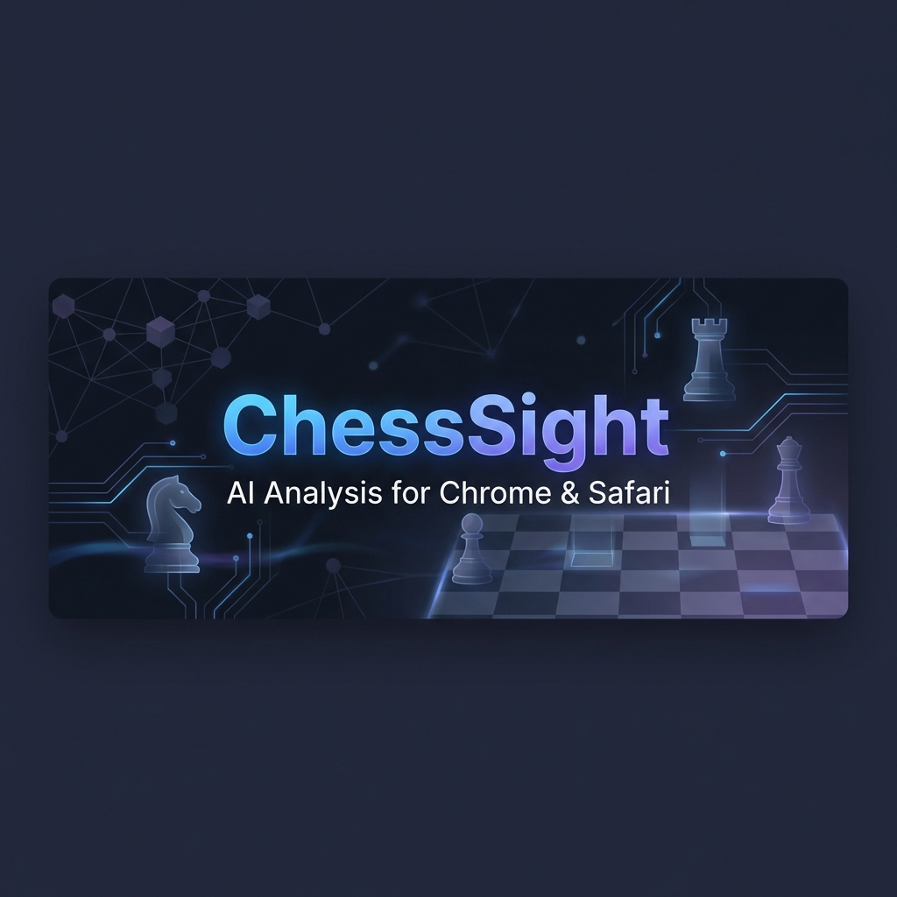
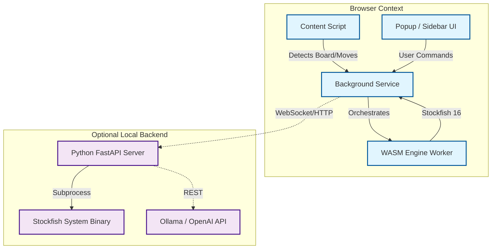

<p align="center">
  <strong>Next-Generation AI Chess Analysis</strong><br>
  <em>Professional Analysis for Chrome & Safari</em>
</p>

<p align="center">
  
  
  
  
</p>

---

## ⚡ Overview

**ChessSight** (formerly Mephisto) is a high-performance browser extension that brings engine-grade chess analysis to your favorite chess websites. 

Unlike basic evaluation tools, ChessSight integrates **Stockfish 16+** directly into your browser via WebAssembly (WASM) for near-instant analysis without server latency, while also offering a local backend mode for leveraging your hardware's full power.

### Key Capabilities
- **🚀 Instant Analysis**: Real-time evaluation using optimized WASM Stockfish binaries.
- **🌐 Universal Support**: Seamlessly works on Chess.com, Lichess, and BlitzTactics.
- **🛡️ Privacy First**: Runs entirely locally in your browser. No game data is sent to external servers unless using the optional LLM chat.
- **🤖 AI Assistant**: Integrated Chat interface connecting to LLMs (Ollama/OpenAI) to explain positions in plain English.
- **🍏 Native Safari App**: Fully signed and native Safari Web Extension for macOS users.

---

## 🏗 System Architecture

ChessSight operates on a modular architecture designed for performance and isolation.



---

## 🚀 Installation

### 1. Chrome (Developer Mode)
1. Clone the repository:
   ```bash
   git clone https://github.com/Mehdys/ChessSight.git
   ```
2. Open `chrome://extensions/`
3. Enable **Developer mode** (top right toggle).
4. Click **Load unpacked** and select the `ChessSight` folder.

### 2. Safari (macOS)
1. Build the native wrapper:
   ```bash
   ./build-safari.sh
   open "Safari/ChessSight/ChessSight.xcodeproj"
   ```
2. In Xcode, select the `ChessSight (macOS)` scheme and run (Cmd+R).
3. Enable the extension in **Safari Settings > Extensions**.

---

## 🛠 Engineering & Development

The project is structured as a modern monorepo:

| Directory | Purpose |
|-----------|---------|
| `src/` | Core extension logic (Content scripts, Background service, UI) |
| `backend/` | Python FastAPI server for heavy-duty analysis & LLM bridging |
| `lib/engine/` | Compiled WASM binaries (Stockfish, Fairy-Stockfish) |
| `Safari/` | Native Swift wrapper for macOS integration |
| `docs/` | Extended documentation (API, Architecture, Roadmap) |

### Building from Source
Ensure you have Node.js 18+ and Python 3.11+.

```bash
# Install backend dependencies
cd backend
pip install -r requirements.txt

# Run backend server (Optional)
./start.sh
```

---

## 🤝 Contributing

We welcome engineering contributions. Please check `docs/CONTRIBUTING.md` for our code standards and pull request process.

## 📄 License

MIT License. See [LICENSE](LICENSE) for details.
